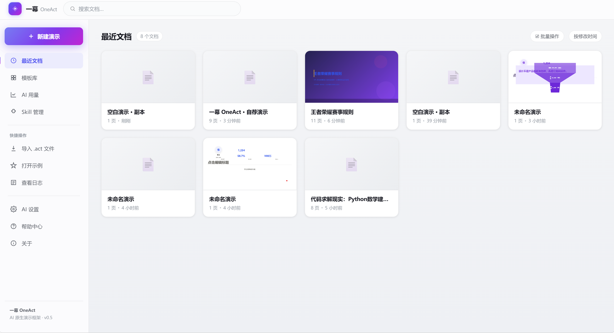
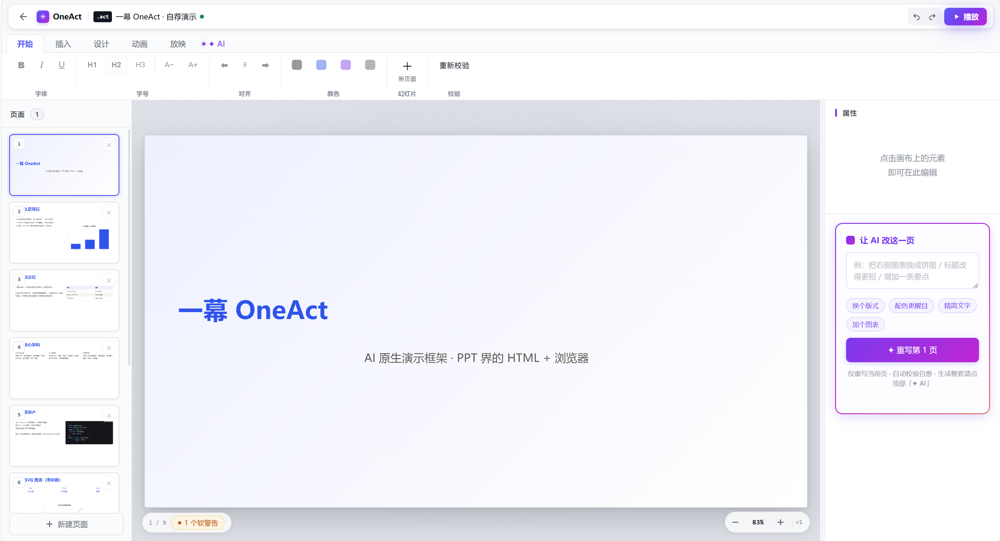
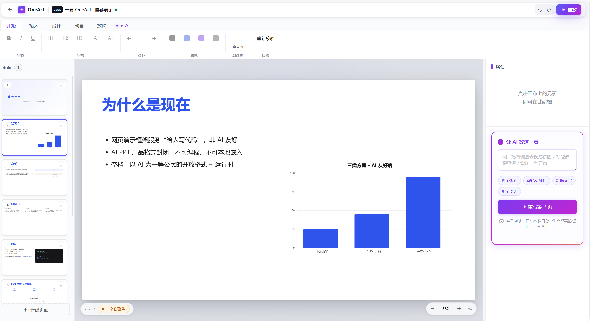
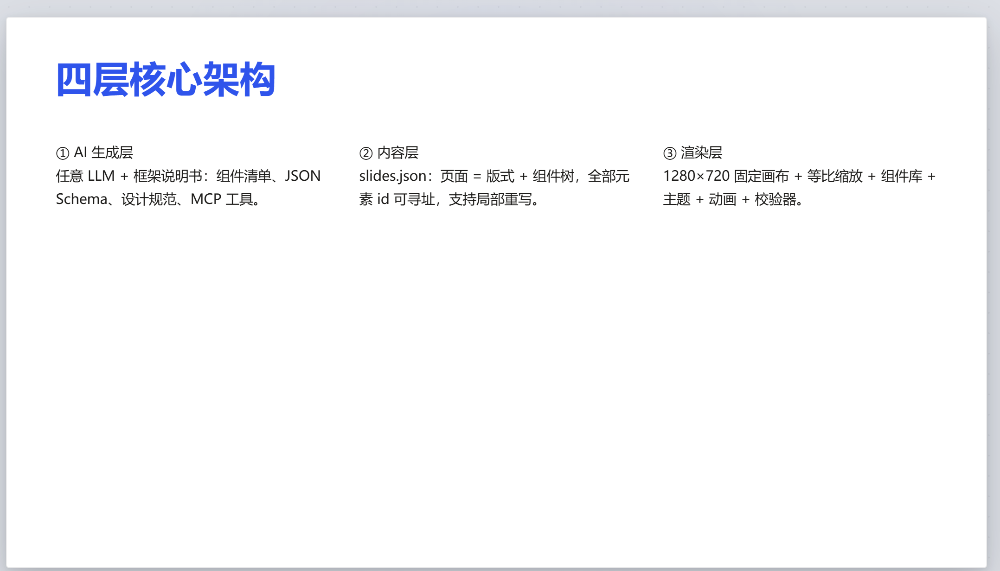
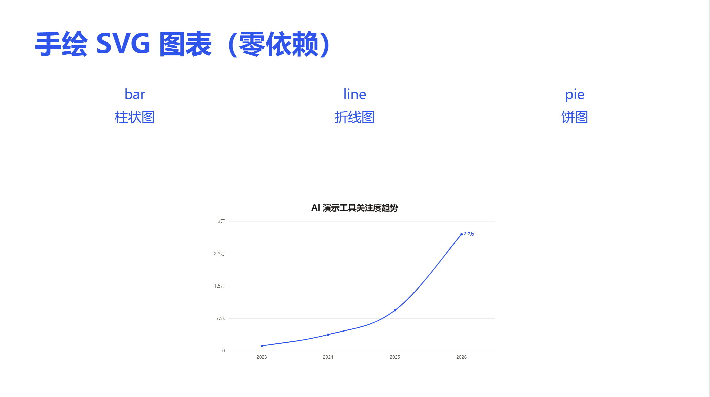
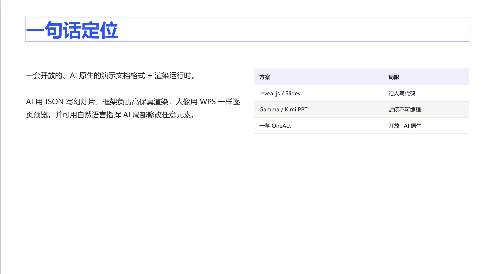
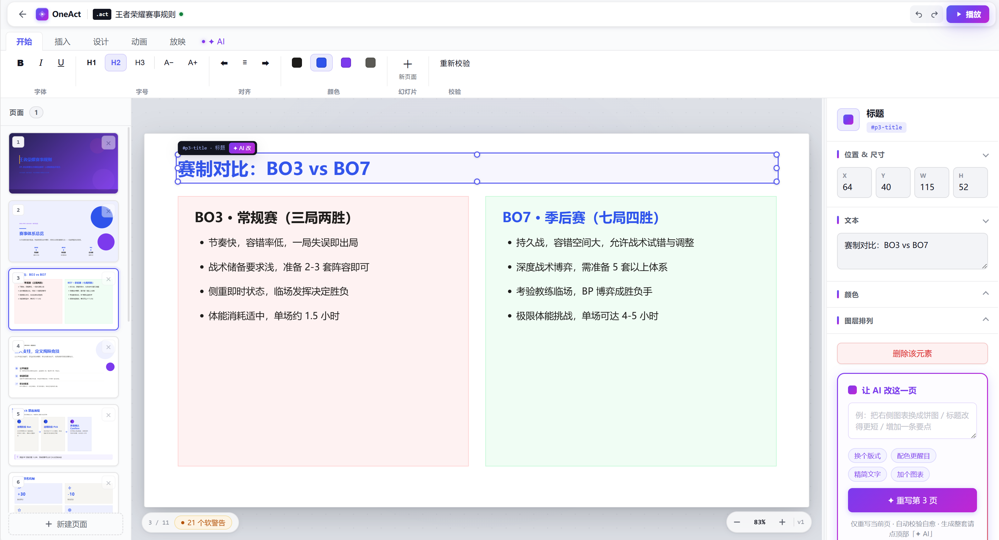

<div align="center">

# 幕 · OneAct

**AI 原生的演示文档格式 + 渲染运行时 —— PPT 界的 HTML + 浏览器。**

*An AI-native presentation format + rendering runtime — the HTML + browser of the slides world.*

[](./LICENSE)
[](https://nodejs.org)
[](https://pnpm.io)
[](#测试)
[](#格式规范)

OneAct 以 AI 为一等公民，定义了一套开放的演示文档格式 `.act` 及其渲染运行时。AI 通过结构化 JSON 声明幻灯片，框架负责高保真渲染；用户可逐页预览，并经自然语言指令驱动 AI 完成页面级局部修改。内置场景化 Skill 系统与多 Agent 编排器，支持从策划、大纲、逐页生成到质量校验、自动修复的全流程自治。

</div>

<br>



*单文件「舞台」播放器 `runtime.html` —— 双击即播 `.act`，缩略图栏、键盘翻页、声明式切换动画与主题切换。*

---

## 概述

OneAct 是一套**开放的、AI 原生的演示文档格式（`.act`）+ 渲染运行时**，定位为「PPT 界的 HTML + 浏览器」。

- **AI 声明式生成**：幻灯片以 `slides.json` 声明式组件树描述，可校验、可程序化编辑，生成质量稳定可复现。
- **高保真渲染运行时**：1280×720 固定画布 + 等比缩放（投影仪模型），确保任意屏幕下布局一致；内置手绘 SVG 图表、声明式动画与 12 套主题。
- **可寻址编辑模型**：每页、每元素具备唯一 `id`，支持仅针对指定页面的局部重写，其余内容不受影响。
- **质量门禁体系**：校验器以硬错误 + 软警告两级规则进行机器可校验，未通过时附带精确定位信息回传 AI 执行自愈。

现有方案中，reveal.js / Slidev / Marp 面向「手写代码」场景，AI 友好度有限；Gamma / Kimi PPT 等产品格式封闭、不可编程、无法本地嵌入。OneAct 填补的空档是：**以 AI 为一等公民的「开放格式 + 运行时」——AI 时代演示文档尚无事实标准，先发者定义标准。**

## 渲染示例

以下截图均由框架真实渲染，取自内置示例 [`examples/self-intro.act.json`](./examples/self-intro.act.json)，非设计稿。

**标题页 · 主题渐变**



**柱状图 · 图表语义层（零依赖手绘 SVG）**



**三卡片版式 · 复合语义组件**



**折线图 · 手绘 SVG 图表**



**表格组件 · 比例列宽**



**引用版式 · 愿景页**


## 应用场景

OneAct 并非传统在线 PPT 工具，而是面向 AI 与程序化驱动的演示基础设施，主要覆盖以下用法：

| 用法 | 说明 |
| --- | --- |
| **Agent 演示能力集成** | 通过 MCP server（6 工具）接入任意 Agent / IDE / CLI，使 AI 直接输出可播放的 `.act` 文档。 |
| **产品内嵌演示模块** | 以 npm SDK 形式输出 HTML 字符串，可嵌入数据周报、AI 助手、BI 看板等 Web 产品。 |
| **自托管批量渲染** | HTTP 渲染服务支持 `POST slides.json → html / act / pptx`，适用于非 JS 环境与自动化渲染管线。 |
| **个人与团队演示** | 提供 Web 编辑器（三栏 + 灵动岛问卷）与单文件播放器，支持双击即播与自包含 HTML 分发。 |

适用领域涵盖 AI 创业项目路演、工作汇报与复盘、学术答辩、产品发布会、数据周报及金融、医疗、教育等行业的专业化演示场景——内置 12 个场景化 Skill 可直接对齐相应风格规范。

## 核心特性

- **格式即资产**：`slides.json` 声明式组件树，可校验、可程序化编辑、AI 生成质量稳定。
- **32 种元素**：13 基础（标题 / 段落 / 列表 / 图表 / 表格 / 形状 / 图标 / 公式 / 音视频 / 逃逸块等）+ 19 复合语义组件（kpi / stat-grid / feature-card / timeline / process / comparison / callout / badge / avatar / pyramid / funnel / stat-highlight / org-chart / gantt / mindmap / ai-card 等），AI 填充语义字段即可生成整组精致视觉。
- **固定画布 + 等比缩放**：1280×720 逻辑坐标系，投影仪模型——任意屏幕下布局完全一致，杜绝重排。
- **20 套版式 + slot 规范**：AI 先选版式再填 slot，坐标取模板值，**零坐标计算**（约束模式）；仅炫技页采用自由坐标。
- **12 套主题**：远山蓝 / 墨绿 / 暖橙 / 科技深色 / 极光紫 / 森林青 / 赤金 / 深海蓝 / 樱粉 / 极简灰 / 日落 / 医疗薄荷，提供完整 design tokens，换肤全局统一。
- **校验器（质量核心）**：硬错误（越界 / id 重复 / 必填缺失）+ 软警告（重叠 / 字号 / 对比度 / 溢出）两级规则机器可校验；未通过时附错误定位回传 AI 自愈。
- **Skill 场景化知识包**：三正交维度（结构 / 视觉风格 / 行业），每维单选可叠加；内置 12 个 skill 并支持用户 Markdown 自导入。
- **多 Agent 编排器**：Director / Generator / Inspector / Healer 四 Agent 协作 + G1 / G2 / G3 三道质量门禁 + Session 会话控制（可取消 / 暂停），事件总线实时推送进度。
- **图表语义层**：AI 仅声明「类型 + 数据」，渲染层负责翻译——零依赖手绘 SVG（bar / line / pie / doughnut / area / radar），颜色统一走主题。
- **声明式动画**：进入 / 强调 / 退出 + 页面切换，命名兼容 Office，参数仅 duration / delay / easing / stagger。
- **AI 工程化**：多模型分档路由（weak / standard / strong）+ token 预算熔断 + SSE 流式 + prompt 版本 A/B 测试 + 内容安全护栏（注入检测 / 输出审核 / 逃逸块扫描）。
- **三入口**：Web 编辑器（三栏 + 灵动岛问卷）/ MCP server（6 工具，接入任意 Agent）/ CLI（9 命令）。
- **多格式导出**：`.act`（JSON + assets 目录，git 可 diff）+ 自包含单 HTML（双击即播）+ `.pptx` 降级导出（32 元素全覆盖，附降级报告）。

## 快速开始

> **前置要求**：Node.js ≥ 18、pnpm ≥ 9（未安装 pnpm 可执行 `corepack enable`）。

```bash
pnpm install          # 安装 workspace 依赖（pnpm 9+）
pnpm test             # 运行全部单测（290 tests / 24 文件）
pnpm build:player     # 构建单文件播放器
```

构建完成后，双击 `packages/player/dist/runtime.html` 即可播放内置「一幕自荐」示例，体验缩略图栏、键盘翻页、切换动画与手绘图表。

**Web 编辑器**（三栏编辑 + AI 生成 + skill 管理）：

```bash
node apps/web/build.mjs   # 构建 dist/editor.html
node apps/web/serve.mjs   # 本地预览服务（http://localhost:5190）
```



*类 WPS 三栏编辑器：左侧缩略图、中部画布点选、右侧属性面板与「让 AI 改这一页」局部重写；顶栏支持 `.act` / `.html` / `.pptx` 导出。*

**CLI**（9 命令）：

```bash
oneact validate examples/self-intro.act.json        # 校验
oneact from-md examples/sample.md out.act.json      # Markdown → .act
oneact export examples/self-intro.act.json out.html # 导出自包含 HTML
oneact export deck.act.json out.pptx                # 降级导出 pptx（附降级报告）
oneact serve examples/self-intro.act.json           # 舞台预览服务（默认 5173）
oneact http                                          # HTTP 渲染服务（POST /render，默认 5200）
oneact benchmark --tier strong                      # 黄金测试集跑分
```

## SDK 集成

**渲染与校验**：

```ts
import { renderDeck, validateDeck } from "@oneact/core";
import "@oneact/components"; // 导入即注册全部 32 个组件
import { LAYOUTS } from "@oneact/layouts";

const deck = await fetch("./self-intro.act.json").then((r) => r.json());
const html = renderDeck(deck); // → HTML 字符串，innerHTML 即挂载
const result = validateDeck(deck, { layouts: LAYOUTS }); // { ok, errors, warnings }
```

**AI 生成（用户自配 key）+ skill 注入**：

```ts
import { createProvider, generateDeck } from "@oneact/ai";
import { BUILTIN_SKILLS, composeSkills } from "@oneact/skills";

const provider = createProvider({ kind: "openai-compatible", apiKey: process.env.KEY!, model: "gpt-4o" });
// 选 skill 组合并注入（路演结构 + Apple极简 + 金融行业）
const skills = composeSkills([
  BUILTIN_SKILLS.find((s) => s.id === "startup-pitch")!,
  BUILTIN_SKILLS.find((s) => s.id === "apple-minimal")!,
  BUILTIN_SKILLS.find((s) => s.id === "finance")!,
]);
const { deck, result, retries } = await generateDeck({
  provider, topic: "AI 创业项目", theme: "mono-slate", skills,
});
// 内置校验自愈：未通过自动重试，仍不通过则如实返回
```

**多 Agent 编排（全流程自治）**：

```ts
import { generate } from "@oneact/orchestrator";
const res = await generate({ provider, answers: { topic: "Q3 复盘" }, skills, onEvent: console.log });
// Director → Generator → Inspector → Healer，三道门禁逐级把关，自愈最多 3 轮
```

## 格式规范

`rect = [x, y, w, h]` 四元数组（1280×720 逻辑像素），便于 AI 准确书写；富文本以 runs 数组描述，支持中英文混排；声明式动画参数极简，显著降低出错率。格式发布后即冻结，仅通过新增迁移器扩展，保证向后兼容，不引入 breaking change。

```json
{
  "id": "el-3", "type": "bullet-list",
  "rect": [64, 218, 572, 318],
  "props": { "items": [
    [{ "text": "中间是空的", "bold": true }]
  ]},
  "anim": { "name": "fly-in-left", "stagger": 120 }
}
```

关键约定：

- **版式为编译时脚手架**：坐标始终为绝对值，支持 AI 微调、编辑器拖拽与校验器计算。
- **z 序等于数组顺序**，不显式存储 z-index。
- **theme 仅存储名称**：token 由主题包解析，切换主题不影响内容。
- **无障碍内建**：image 组件 `alt` 字段必填（缺省触发软警告），chart 组件提供 `summary` 文字摘要。

## 仓库结构

```
oneact/
├── packages/
│   ├── schema/          格式定义 + 32 元素类型 + 校验器 + 迁移器 + JSON Schema + 12 主题
│   ├── core/            渲染引擎 + 组件注册表 + 主题/动画引擎 + 离屏测量
│   ├── components/      32 个内置组件（手绘 SVG 图表 + 逃逸块消毒 + KaTeX 公式）
│   ├── layouts/         20 套版式 + slot 规范 + auto 高度引擎
│   ├── ai/              provider 适配 + 两段式生成 + 校验自愈 + 分档路由 + 预算 + 流式 + 安全护栏 + skill 应用
│   ├── skills/          场景化 skill（三维度 + 12 内置 + Markdown 导入解析）
│   ├── orchestrator/    多 Agent 编排（4 Agent + 3 门禁 + Session + 事件总线）
│   ├── player/          单文件播放器 runtime.html
│   ├── exporter-deck/   .act 打包 + 自包含单 HTML
│   ├── exporter-pptx/   pptx 降级导出（32 元素全覆盖 + 降级报告）
│   ├── mcp/             MCP server（6 工具，任意 Agent 接入）
│   └── cli/             9 命令（validate/init/from-md/from-pptx/export/serve/http/benchmark）
├── apps/
│   ├── web/             在线编辑器（三栏 + 灵动岛问卷 + skill 管理 + AI 可视化）
│   └── desktop/         Tauri 壳（关联 .act，复用 player runtime）
└── examples/            self-intro.act.json「一幕自荐」+ golden 黄金集 + sample.md
```

## 测试

```bash
pnpm test   # vitest，290 tests / 24 文件
```

测试覆盖范围：校验器、几何计算、动画、图表 SVG 渲染、HTML 消毒、版式、自愈循环、编排门禁、skill 叠加、frontmatter 解析。

## 演进路线

| 版本 | 状态 | 内容 |
| --- | --- | --- |
| **v0.1** | ✅ 已完成 | 单文件 player + schema / 校验器 / 迁移器 + 25 组件 + 20 版式 + 12 主题 + 动画 + 图表 SVG + AI 生成层 + CLI |
| **v0.2** | ✅ 已完成 | md2act、HTTP 渲染服务、pptx 导入文本提取、离屏测量 |
| **v0.3** | ✅ 已完成 | 流式按页预览 + 黄金测试集跑分（多档模型）+ 多模型分档路由 + token 预算 + prompt A/B + 安全护栏 |
| **v1** | ✅ 已完成 | MCP server（6 工具）+ Web 编辑器（三栏 + AI 局部重写 + 灵动岛问卷）+ pptx 降级导出 |
| **+** | ✅ 已完成 | 多 Agent 编排器（4 Agent + 3 门禁 + Session）+ Skill 系统（三维度 + 12 内置 + 自导入） |
| **v0.5** | ✅ 已完成 | 复合组件扩展至 19（+pyramid / funnel / stat-highlight / org-chart / gantt / mindmap / ai-card）+ radar 图表 + 3 skill（education / roadmap / magazine） |
| v2 | 规划中 | 桌面端编译发布、协作（CRDT）、演讲者视图双屏 |
| v3 | 规划中 | 插件 / skill 市场、HTTP 渲染服务增强 |

核心地基、AI 生成、编辑器、多 Agent 编排与 skill 系统均已实现并通过测试（290 tests 通过）。后续版本聚焦于生态扩展与协作能力。

## 能力接入状态

Web 编辑器当前直接使用 `@oneact/ai`（两段式生成 + 流式按页 + 局部重写）。以下能力**已实现并通过测试、作为 SDK 级公开 API 提供，编辑器暂未集成**，可通过 SDK / CLI / MCP 使用：

| 能力 | 包 | 说明 |
| --- | --- | --- |
| 多 Agent 编排（4 Agent + 3 门禁 + Session） | `@oneact/orchestrator` | SDK 可用，编辑器未接入 |
| Token 预算熔断（会话级 + 日级） | `@oneact/ai` · budget | SDK 可用，未接入生成回路 |
| Prompt 版本管理 + A/B 测试 | `@oneact/ai` · prompt-version | SDK 可用，未接入 |

上述 API 均有完整测试覆盖；编辑器的可视化编排与预算面板规划于 v2 版本集成。

## 设计决策

- **两级生成模式**：约束模式（默认，坐标取 slot）+ 自由坐标（逃逸层专用）——从机制层面规避 LLM 空间推理能力薄弱的问题。
- **Skill 三维度正交**：structure（骨架）/ style（视觉）/ domain（行业）可叠加；`composeSkills` 仅收集、`applySkill` 执行仲裁（优先级：用户显式输入 > skill > 原推断）；单一注入入口 `SpecOptions.skills`，无 skill 时 `buildSpec` 输出零变化。
- **格式版本化**：`formatVersion` + 链式迁移器，格式冻结后不引入 breaking change。
- **核心框架无关**：渲染核心输出 HTML 字符串，不绑定 React；player 为纯 DOM 实现。
- **资源策略**：`.act` 使用同名 `.assets/` 目录（git diff 友好，不做 base64 内联），base64 仅用于自包含 HTML 分发产物。
- **逃逸块安全沙箱**：`iframe sandbox` + DOMPurify 消毒 + 静态扫描，确保打开第三方分享的 `.act` 文档时的安全性。
- **密钥本地化**：模型 key 仅存储于用户本地，不经过任何服务器。

完整设计文档见 [`./策划书.md`](./策划书.md)。

## 贡献

欢迎通过 Issue 与 Pull Request 参与贡献。提交前请执行 `pnpm lint && pnpm typecheck && pnpm test`，并遵循 [Conventional Commits](https://www.conventionalcommits.org/) 规范（仓库已配置 commitlint + husky 自动校验）。

- **缺陷报告**：请提交 [Issue](./issues)，并附最小复现（`.act` 文件或 JSON 片段）。
- **功能建议**：请先发起 Issue 讨论，达成共识后再提交 PR。
- **文档与示例**：`examples/` 目录同样欢迎贡献。
- **主题 / 版式 / Skill 扩展**：主题即 token 组、skill 即 Markdown，均为低门槛的贡献方向。

## 许可证

[Apache-2.0](./LICENSE)（含专利授权条款，适用于商业场景）。© 2026 一幕 OneAct Contributors。
